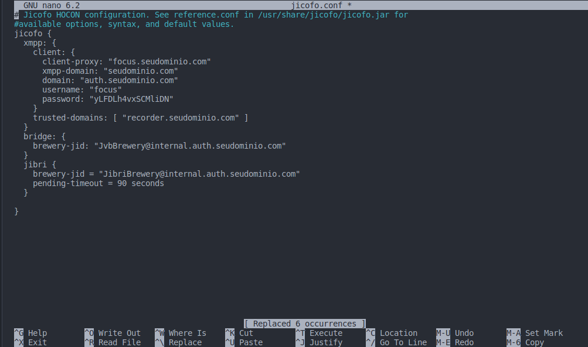

# Guia de Auto Scaling Jitsi, Jibri-docker na AWS

[](https://github.com/Deyvi-dev)

# Descrição

Este guia é um passo a passo que apresenta o processo de auto scaling para Jitsi e Jibri-docker na AWS. Utilizaremos instâncias EC2 para o Jitsi e o Jibri, com cada instância do Jibri contendo 4 contêineres. O auto scaling será realizado de forma horizontal, aproveitando recursos como CloudWatch, Amazon EC2 Auto Scaling e AWS S3.

No servidor do Jitsi, será implantado um script cronjob  para verificar a disponibilidade de instâncias do Jibri. Quando apenas uma instância do Jibri estiver disponível, um alerta será enviado para a AWS, solicitando o início de uma nova instância do Jibri.

Além disso, no servidor do Jibri, um script cronjob será configurado para consultar a cada minuto se os contêineres estão em uso. Caso não estejam em uso e a API do Jitsi retorne que há mais de 5 instâncias do Jibri disponíveis, a instância será automaticamente encerrada, mantendo o fluxo do auto scaling.

# Documentação

- [# Criação de Máquinas EC2 do Jitsi](#criação-de-máquinas-ec2-do-jitsi)
- [# Instalação do Jitsi](#instalação-do-jitsi)
- [# Ajustando um ambiente Jitsi Meet para o Jibri](#ajustando-um-ambiente-jitsi-meet-para-o-jibri)
- [# Criação de Máquina EC2 do Jibri](#criação-de-máquina-ec2-do-jibri)
- [# Instalação do Jibri-docker](#instalação-do-jibri-docker)
- [# Envio dos videos para AWS S3](#Envio-dos-videos-para-AWS-S3)

# Criação de Máquinas EC2 do Jitsi

Para criar as máquinas EC2 do Jitsi, siga as etapas abaixo:

* Acesse o [Console da AWS](https://us-east-1.console.aws.amazon.com/console/home?region=us-east-1).
* Pesquise por "EC2" na barra de pesquisa do console.
* Selecione a região desejada, no meu caso foi a us-east-1.
* Clique em "executar instâncias", mostrado na imagem abaixo:


* Coloque um nome para a instância no meu caso é o jitsi


* escolha uma imagem. Neste guia, usaremos a imagem Ubuntu Server 22.04 LTS:


* Selecione um tipo de instância t3.medium.

* Gere um par de chaves para acessar via SSH.

* Crie um grupo de segurança com intervalo de portas 5280, 443, 22, 5349, 10000, 3478, 80, 5222 e 8888, com origem 0.0.0.0/0. Veja o exemplo na imagem abaixo:


* Adicione um IP elástico à instância. Você precisará de um domínio e deverá apontar o DNS para o IP escolhido.


# Instalação do Jitsi

### Para instalação Jitsi, usaremos o guia de instalação do jitsi [Self-Hosting Guide - Debian/Ubuntu server](https://jitsi.github.io/handbook/docs/devops-guide/devops-guide-quickstart):


## Pré requisitos:
### Acesse o servidor Jitsi via SSH usando a chave criada

* Abra o terminal no seu computador.

* Mude as permissões do arquivo de chave para garantir que apenas você possa acessá-lo. Substitua `jitsi.pem` pelo nome do seu arquivo de chave, se necessário.

```bash
chmod 400 jitsi.pem
```

* Conecte-se ao servidor Jitsi usando SSH e a chave privada. Substitua `jitsi.pem` pelo nome do seu arquivo de chave e `seu_endereco_ip` pelo endereço IP do servidor Jitsi.

```bash
ssh -i jitsi.pem ubuntu@seu_endereco_ip
```

### Atualize as versões mais recentes dos pacotes em todos os repositórios, Em seguida instale o suporte para repositórios do apt servidos via HTTPS:

```bash
sudo apt update && sudo apt -y upgrade
sudo apt install apt-transport-https
```

* Em sistemas Ubuntu, o Jitsi requer dependências do Ubuntu universerepositório de pacotes. Para garantir que isso esteja ativado, execute este comando: 

```bash
sudo apt-add-repository universe
```

* Recupere as versões de pacote mais recentes em todos os repositórios `sudo apt update`

### Configure o nome de domínio totalmente qualificado (FQDN)

```bash
sudo hostnamectl set-hostname seudominio.com
```
* Em seguida, adicione o mesmo FQDN no /etc/hosts no arquivo: 
`sudo nano /etc/hosts`

```bash
127.0.0.1 localhost
x.x.x.x seudominio.com
```

:warning: **Observação:** Substitua `x.x.x.x` pelo endereço IP público do seu servidor.

### Adicione o repositório de pacotes Prosody

#### Ubuntu 18.04 e 20.04 

```bash
echo deb http://packages.prosody.im/debian $(lsb_release -sc) main | sudo tee -a /etc/apt/sources.list
wget https://prosody.im/files/prosody-debian-packages.key -O- | sudo apt-key add -
apt install lua5.2
```

#### Ubuntu 22.04

```bash
curl -sL https://prosody.im/files/prosody-debian-packages.key | sudo tee /etc/apt/keyrings/prosody-debian-packages.key
echo "deb [signed-by=/etc/apt/keyrings/prosody-debian-packages.key] http://packages.prosody.im/debian $(lsb_release -sc) main" | sudo tee /etc/apt/sources.list.d/prosody-debian-packages.list
apt install lua5.2
```

### Adicione o repositório de pacotes Jitsi

#### Ubuntu 18.04 e 20.04 

```bash
curl https://download.jitsi.org/jitsi-key.gpg.key | sudo sh -c 'gpg --dearmor > /usr/share/keyrings/jitsi-keyring.gpg'
echo 'deb [signed-by=/usr/share/keyrings/jitsi-keyring.gpg] https://download.jitsi.org stable/' | sudo tee /etc/apt/sources.list.d/jitsi-stable.list > /dev/null
```

#### Ubuntu 22.04

```bash
curl -sL https://download.jitsi.org/jitsi-key.gpg.key | gpg --dearmor | sudo tee /usr/share/keyrings/jitsi-keyring.gpg
echo "deb [signed-by=/usr/share/keyrings/jitsi-keyring.gpg] https://download.jitsi.org stable/" | sudo tee /etc/apt/sources.list.d/jitsi-stable.list
```

* Atualize todas as fontes do pacote `sudo apt update`

#### Instale e configure seu firewall 
As mesmas portas que foram abertas na aws tem que ser abertas dentro do seu servidor jitsi
use esse comando para abrir

```bash
sudo ufw allow 80/tcp
sudo ufw allow 443/tcp
sudo ufw allow 10000/udp
sudo ufw allow 22/tcp
sudo ufw allow 3478/udp
sudo ufw allow 5349/tcps
sudo ufw allow 5280/tcp
sudo ufw allow 5222/tcp
sudo ufw allow 8888/tcp
sudo ufw enable
```

Verifique o status do firewall com: 

```bash
sudo ufw status verbose
```

## Instale o Jitsi Meet 

```bash
sudo apt install jitsi-meet
```

Ao executar este comando, primeiro será solicitado o nome do domínio.  Basta digitar o endereço DNS do seu servidor:

Em seguida, você será questionado sobre o certificado.  Escolha o certificado autoassinado por enquanto:

### Registro SSL
registre um certificado SSL válido no serviço Let's Encrypt.  É gratuito e bem implementado nas ferramentas Jitsi.  Basta executar o seguinte comando em seu servidor via SSH:

```bash
sudo /usr/share/jitsi-meet/scripts/install-letsencrypt-cert.sh
```

# Ajustando um ambiente Jitsi Meet para o Jibri

## Configurando um ambiente do Jitsi Meet para o Jibri requer a ativação de certas configurações. Isso inclui a configuração de virtualhosts e contas no Prosody, bem como ajustes específicos para a interface web do Jitsi Meet
## Configure o Prosody
### Crie a entrada do componente MUC interno. Isso é necessário para que os clientes do Jibri possam ser descobertos pelo Jicofo em um MUC que não seja acessível externamente pelos usuários do Jitsi Meet

* execute 

```bash
sudo nano /etc/prosody/prosody.cfg.lua
```

* Adicione o seguinte no arquivo

```bash
-- internal muc component, meant to enable pools of jibri and jigasi clients
Component "internal.auth.seudominio.com" "muc"
    modules_enabled = {
      "ping";
    }
    -- storage should be "none" for prosody 0.10 and "memory" for prosody 0.11
    storage = "memory"
    muc_room_cache_size = 1000
```

* quase no final do arquivo na area resevada para virtual host adcione isso

```bash
VirtualHost "recorder.seudominio.com"
  modules_enabled = {
    "ping";
  }
  authentication = "internal_plain"
```

* Salve o arquivo e saia dele

:warning: Certifique-se de substituir yourdomain.com pelo domínio adequado do seu ambiente Jitsi Meet.
Essa configuração permitirá que apenas as sessões autenticadas do Jibri Chrome sejam participantes ocultos na conferência que está sendo gravada, fornecendo restrições de acesso adequadas

### Pelo seu terminal Configure as duas contas que o jibri usará.

```bash
prosodyctl register jibri auth.seudominio.com jibriauthpass
prosodyctl register recorder recorder.seudominio.com jibrirecorderpass
```

A primeira conta é aquela que o Jibri usará para fazer login no MUC de controle (onde o Jibri enviará seu status e aguardará os comandos). A segunda conta é aquela que a Jibri usará como cliente no Selenium ao ingressar na chamada para que possa ser tratada de maneira especial pela IU da Web do Jitsi Meet

* De um reload no Jicofo

```bash
sudo systemctl reload jicofo
```

## Configure o Jicofo

### Editar `/etc/jitsi/jicofo/jicofo.conf`, defina o MUC apropriado para procurar os controladores Jibri. Reinicie o Jicofo após definir esta propriedade. Também é sugerido definir o tempo limite pendente para 90 segundos, para permitir que o Jibri tenha algum tempo para inicializar antes de ser marcado como com falha

* execute 

```bash
sudo nano /etc/jitsi/jicofo/jicofo.conf
```

* Adicione o seguinte no arquivo

```bash
jibri {
    brewery-jid = "JibriBrewery@internal.auth.seudominio.com"
    pending-timeout = 90 seconds
  }
```

* ficará algo parecido com isso



## Configure UI o Jitsi meet

### Para habilitar botões de gravações e transmissão ao vivo

* Edite o `/etc/jitsi/meet/seudominio.com-config.js` arquivo, adicione/defina as seguintes propriedades: 

```bash
recordingService: {
  enabled: true,
},

fileRecordingsEnabled: true, // If you want to enable file recording
liveStreamingEnabled: true, // If you want to enable live streaming
hiddenDomain: 'recorder.seudominio.com',
```

* Por fim reinicie o jicofo jitsi e prosody

```bash
sudo /etc/init.d/prosody restart
sudo /etc/init.d/jicofo restart
sudo /etc/init.d/jitsi-videobridge2 restart
```

### Reincie seu servidor `sudo reboot`e sua instacia. Você ja poderá acessa o jitsi na web  pelo seu host

exemplo: `seudominio.com`

# Criação de Máquina EC2 do Jibri

Para criar as máquinas EC2 do Jibri-docker, siga as etapas abaixo:
* Acesse o [Console da AWS](https://us-east-1.console.aws.amazon.com/console/home?region=us-east-1).
* Pesquise por "EC2" na barra de pesquisa do console.
* Selecione a região desejada, no meu caso foi a us-east-1.
* Clique em "executar instâncias", mostrado na imagem abaixo:


* Coloque um nome para a instância no meu caso é o jibri-docker


* escolha uma imagem. Neste guia, usaremos a imagem Ubuntu Server 18.04 Bionic:


* Selecione um tipo de instância t2.xlarge.

* Gere um par de chaves para acessar via SSH.

* Crie um grupo de segurança com intervalo de portas 5280, 443, 22, 5349, 10000, 3478, 80, 5222 e 8888, com origem 0.0.0.0/0. Veja o exemplo na imagem abaixo:


* Adicione um IP elástico à instância. Você precisará de um domínio e deverá apontar o DNS para o IP escolhido.


# Instalação do Jibri-docker

### Para instalação Jibri, usaremos  Guia de auto-hospedagem - Docker, porém utilizando so as imagens e recursos do Jibri  [Self-Hosting Guide - Docker](https://jitsi.github.io/handbook/docs/devops-guide/devops-guide-quickstart):

## Pré requisitos:

### Acesse o servidor Jibri via SSH usando a chave criada

* Abra o terminal no seu computador.

* Mude as permissões do arquivo de chave para garantir que apenas você possa acessá-lo. Substitua `jibri.pem` pelo nome do seu arquivo de chave, se necessário.

```bash
chmod 400 jitsi.pem
```

* Conecte-se ao servidor Jibri usando SSH e a chave privada. Substitua `jibri.pem` pelo nome do seu arquivo de chave e `seu_endereco_ip` pelo endereço IP do servidor Jibri.

```bash
ssh -i jibri-docker.pem ubuntu@seu_endereco_ip
```

### Atualizações de pacotes

* No console, escreva o seguinte comando para atualizar seu sistema:

```bash
sudo apt update && sudo apt -y upgrade
```

### Baixe e extraia [latest release](https://github.com/jitsi/docker-jitsi-meet/releases/latest) nesse gui foi utilizado a versao stable-8719: release

#### Execute esse comando para fazer o download do arquivo e extraia no seu servidor jibri

```bash
wget https://github.com/jitsi/docker-jitsi-meet/archive/refs/tags/stable-8719.tar.gz
```

```bash
tar -zxvf stable-8719.tar.gz
```

* Acesse a pasta com `cd docker-jitsi-meet-stable-8719  `

# Envio dos video para AWS S3